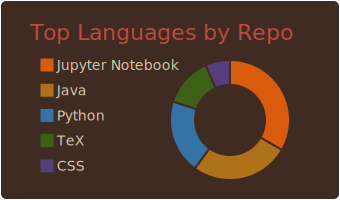

<table border="0">
 <tr>
     <td>
Hi, welcome to my profile! 
I'm Lukas Mettler, Physics M.Sc. student at Karlsruhe Institute of Technology, KIT.
 

My interests include
- Dark Matter, particle and astroparticle physics
- Data analysis, statistics and Monte Carlo simulation
- Photography and photo editing with [darktable](https://www.darktable.org/)
    </td>
    <td>
        
    </td>
 </tr>
</table>

