<!--Header by https://capsule-render.vercel.app -->

    

I'm Lukas Mettler, a Physics M.Sc. student at Karlsruhe Institute of Technology, KIT.

My interests include

- Dark Matter, cosmology, particle and astroparticle physics
- Data analysis, statistics and Monte Carlo simulation

<!-- horizonal line -->

    

### [Click here for some of my photography](https://github.com/LEMettler/photography)

<!-- images with relative width -->

 
 
 
 
 

<!-- horizonal line -->

    

<!-- repositories -->

### Code and Physics

I'm currently working on learning about svg-animations, see my current header or [SVG-Collisions](https://github.com/LEMettler/svg-collision), a small CLI program I'm working on
to build animations of particle collisions.

#### Physics and simulations

- [**lumiere**](https://github.com/LEMettler/lumiere) 
My python wrapper of scipy, numpy and matplotlib operations to streamline scientific data handling, fitting and  mathematically correct errorbands in personal everyday use.

- [**QFT-calculations**](https://github.com/LEMettler/QFT-calculations) 
Miscellaneous Quantum Field Theory calculations and notes.

- [**particleQT**](https://github.com/LEMettler/particleQT) 
A GUI application to check whether particle interactions of leptons, bosons and many hadrons satisfy the conservation of quantum numbers.

- [**Forest Fire Model**](https://github.com/LEMettler/forest-fire-model) 
 Animated python simulation of a cellular grid to simulate the spread of forest fires.

- [**Stick-Slip Friction Model**](https://github.com/LEMettler/stick-slip-model) 
Simulation of the friction behaviour of two objects moving over one another.

#### Machine Learning 

- [**Numpy DNN**](https://github.com/LEMettler/MNIST_in_numpy) 
A neural network build from scratch, not relying on frameworks like TensorFlow. All matrix calculations, including backpropagation steps, are explained to gain a deep understanding of the underlying processes.

- [**Higgs Challenge**](https://github.com/LEMettler/higgs-challenge) 
My take on the Kaggle Higgs-Boson Machine Learning Challenge with a DNN setup for a 2.6 AMS score aswell as a custom Gaussian Mixture Classifier approach.

- [**NLP lyrics generator**](https://github.com/LEMettler/NLP_lyrics_generator/blob/main/eurobeatNLP.ipynb) 
Tests of implementing a LSTM on song lyrics using the Pytorch library. Ultimately limited by the my laptops computing power.

#### C++

- [**Sudoku Solver**](https://github.com/LEMettler/sudoku_solver) 
A 9x9-Sudoku solving algorithm that, unlike other implemtations, works in an iterative manner.
Implementations in python and C++.

#### $\LaTeX$

- [**LaTeX template**](https://github.com/LEMettler/latex-template) 
My go-to $\LaTeX$ template. Pretty frontpage and useful commands included.

- [**LaTeX table generator**](https://github.com/LEMettler/latex_table_generation) 
A simple python module to convert your data arrays/lists to code for a $\LaTeX$ table.

    
#### Android applications (Java and Kotlin)

- [**Sleep Timer**](https://github.com/LEMettler/SleepTimer) 
A timer that stops applications from playing music.

- [**Circle Builder**](https://github.com/LEMettler/CircleBuilder) 
A game to define obstacles and find paths around them to connect all free spaces.

- [**Action Counter**](https://github.com/LEMettler/ActionCounter) 
A simplistic interface for counting with plus/minus buttons.

- [**Entity Task**](https://github.com/LEMettler/EntityTask) 
A school project of an Android task manager. Users are rewarded for completing tasks with a XP system. 

<!-- horizonal line -->

    

<!-- badges -->
<table border="0" align="center">
 <tr>
     <td>

    </td>
 </tr>
</table>
